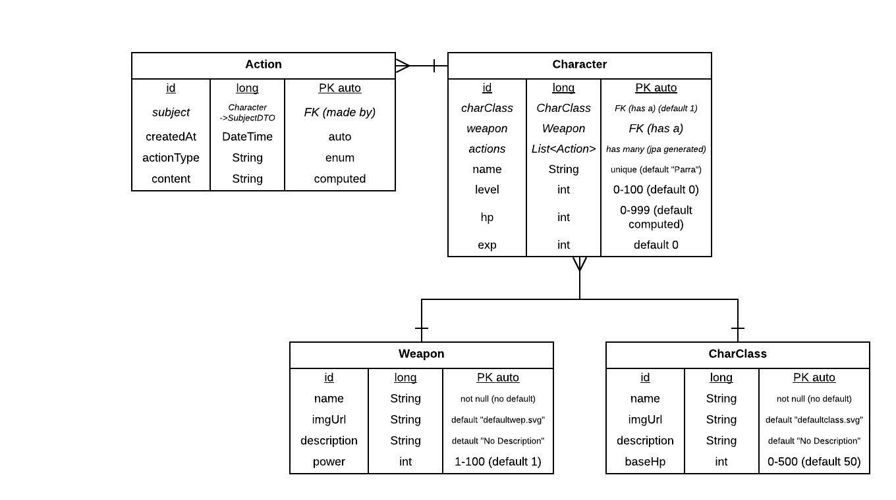

# Evaluación 1

Desarrollar un programa que simule la acción de un juego de RPG.

Los requerimientos son:

* El programa deberá poder instalarse o bien jugarse en una plataforma web.
* El tema será de batallas teniendo 4 personajes.
  * **Rey** que por defecto cuenta con una *espada*.
  * **Arquero** quien por defecto cuenta con un *arco y flecha*.
  * **Ogro** quien por defecto cuenta con una *hacha*.
  * **Caballero** quien por defecto cuenta con una *lanza*.
* Cada acción realizada deberá grabarse en una base de datos para poder ser consultada después (grabar la acción, quién la solicitó y la hora de la petición).
* Cada personaje podrá cambiar arma a su antojo.
* Deberá contar con un menú para navegar entre las acciones y selección.
* La bitácora o *log* que se consulte deberá contar con filtros como:
  * Por personaje
  * Por acción (ej: cambiar arma)

Los resultados de las búsquedas podrán ser exportadas a un documento PDF.

